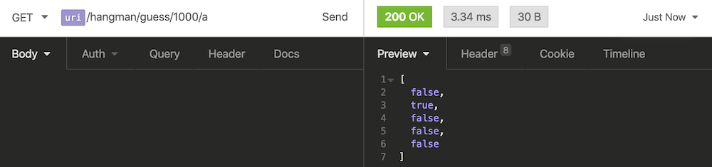

# Module 3 - Node - RESTful APIs

## Exercise 2 - Client List

| endpoints | method | Description |
| -------- | ------ | ---------------------- |
| `/`  | `GET`  | Redirects to the `/clients` endpoint. |
| `/clients`  | `GET`  | Returns the clients array. |
| `/clients/:id`  | `GET`  | Returns a specific client object by id. |
| `/clients`  | `POST`  | Adds a new client object to the clients array. |
| `/clients/:id`  | `DELETE`  | Deletes a specific client object by id. |

---

## Exercise 3 - Hangman

| endpoints | method | Description |
| -------- | ------ | ---------------------- |
| `/hangman/word`  | `GET`  | Returns an object with the `id` and `letterCount` of a random word. |
| `/hangman/word/:id`  | `GET`  | Returns a word object by it's `id`. |
| `/hangman/guess/:id/:letter`  | `GET`  | Returns an array of booleans _only_ if `:letter` exists in the word. |

Ex: `{ "id": "1000", "word": "bacon", "letterCount": "5" }`

